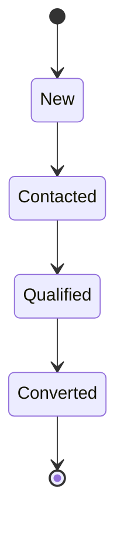

# Lead CRM — SDD Modeler Sample

This folder contains a small Spring Boot sample application that demonstrates SDD Modeler features and generated code. The sample includes a state model, generated Java sources, a CLI for generating PostgreSQL DDL, and helper scripts to run Postgres locally and populate it with sample data.

## Lead state model



States:

- New — a newly created lead
- Contacted — the lead was contacted by a salesperson
- Qualified — the lead is qualified (budget / timeline)
- Converted — the lead is converted into a customer

## Local Postgres (Docker Compose)

Start a local Postgres instance for the sample:

```bash
docker compose -f sample/docker-compose.yml up -d
```

Stop the container:

```bash
docker compose -f sample/docker-compose.yml down
```

Reset the database by removing the volume (fresh initialization):

```bash
docker compose -f sample/docker-compose.yml down -v
```

The Compose file starts a container named `lead-crm-db`. The `sample/scripts/` directory is mounted into the container for convenience.

Note: the application connects to the `public_states` schema (where the generated DDL creates state tables). The sample `application.yml` sets the JDBC parameter `currentSchema=public_states,public` so entity mappings without a schema will resolve correctly. If you modify the DDL schema or the JDBC settings, ensure the `currentSchema` is updated accordingly.

## Helper script: generate & apply schema + data

Use the helper script to generate the DDL, ensure the `uuid-ossp` extension exists (if needed), and apply the schema and sample data in the correct order. The script supports `--fresh` which clears the Postgres volume so the DB starts clean.

```bash
# From the repository root
./sample/scripts/apply-schema.sh --fresh
```

## (Optional) Manual generation & application steps

```bash
# Generate Java sources
./gradlew :sample:clean :sample:generateSdd

# Generate DDL with CLI (optional)
./gradlew :state-modeler-app:run --args="sql sample/src/main/resources/sdd.yaml -o sample/build/schema.sql"

# Apply DDL and sample data (container must be running)
# Note: the sample script applies UUID extension and inserts the sample data in the correct order.
docker exec -i lead-crm-db psql -U postgres -d postgres < sample/build/schema.sql
docker exec -i lead-crm-db psql -U postgres -d postgres < sample/scripts/sample-data.sql
```

## Verify the sample data

```bash
docker exec -i lead-crm-db psql -U postgres -d postgres -c "SELECT state_type, COUNT(*) FROM public_states.lead_state GROUP BY state_type;"
```

```bash
docker exec -i lead-crm-db psql -U postgres -d postgres -c "SELECT state_type, COUNT(*) FROM public_states.lead_state GROUP BY state_type;"
```

## Run the sample application

```bash
./gradlew :sample:bootRun
```

The application will be accessible at <http://localhost:8080>.

## API endpoints

- `GET /api/leads` — list all leads
- `GET /api/leads/new/{id}` — lead in New state
- `GET /api/leads/contacted/{id}` — lead in Contacted state
- `GET /api/leads/qualified/{id}` — lead in Qualified state
- `GET /api/leads/converted/{id}` — lead in Converted state
- `POST /api/leads/{id}/transitions/toContacted` — New → Contacted
- `POST /api/leads/{id}/transitions/toQualified` — Contacted → Qualified
- `POST /api/leads/{id}/transitions/toConverted` — Qualified → Converted

## Tests

Unit tests:

```bash
./gradlew :sample:test
```

Open `sample/build/generated/sdd/http/lead.http` in your editor to run HTTP sample requests.

## Project layout (sample)

```text
sample/
├── src/main/
│   ├── java/                 # application sources
│   └── resources/
│       ├── sdd.yaml          # SDD model
│       └── application.yml   # Spring Boot configuration
├── build/
│   ├── schema.sql            # generated DDL
│   └── generated/sdd/        # generated Java sources
├── docker-compose.yml        # local Postgres configuration
└── scripts/
    ├── apply-schema.sh       # helper: generate & apply DDL + sample data
    └── sample-data.sql       # sample data insertion script (PL/pgSQL)
```

## Sample data & UUIDs

The sample uses `uuid_generate_v4()` from the `uuid-ossp` extension in a PL/pgSQL script that inserts leads and state rows while capturing generated IDs to maintain proper FK references. This avoids hardcoding sequence numbers and ensures the correct insertion order.

## Modify the sample model

1. Edit `sample/src/main/resources/sdd.yaml` to change the model.
2. Re-generate Java sources: `./gradlew :sample:generateSdd`.
3. Re-generate the DDL: `./gradlew :state-modeler-app:run --args="sql sample/src/main/resources/sdd.yaml -o sample/build/schema.sql"`.
4. Re-apply the schema & sample data using `sample/scripts/apply-schema.sh` or the manual steps above.

## Links

- SDD Modeler docs: `../README.md`
- Model DSL guide: `../state-modeler-core/README.md`
- Gradle plugin guide: `../state-modeler-gradle-plugin/README.md`

---

This file is the documentation for the `sample` module.
