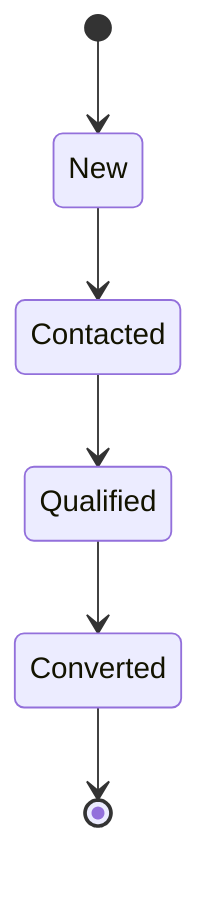

# Lead CRM - SDD Modeler Sample

Exemple d'application Spring Boot démontrant l'utilisation de SDD Modeler pour gérer un système de Lead CRM avec 4 états.

## 🎯 Modèle Lead CRM

Ce projet implémente un système de gestion de leads avec les états suivants:



- **New**: Nouveau lead entrant (email, téléphone, source)
- **Contacted**: Lead contacté (date, par qui, notes)
- **Qualified**: Lead qualifié (budget, timeline, notes)
- **Converted**: Lead converti en client (valeur contrat, commercial)

## 🐳 Configuration PostgreSQL avec Docker

### Démarrer PostgreSQL

```shell
# Depuis le répertoire sample
docker-compose up -d
```

### Vérifier que PostgreSQL est démarré

```shell
docker-compose ps
```

### Arrêter PostgreSQL

```shell
docker-compose down
```

### Supprimer les données (reset complet)

```shell
docker-compose down -v
```

## 🛠️ Génération du Code et du Schéma

### 1. Générer le code Java

Le code generator SDD Modeler produit automatiquement:

- Code Java (DTOs, Repositories, Services, Controllers)
- Tests HTTP dans `build/generated/sdd/http/`

```shell
# Depuis le répertoire racine du projet
./gradlew :sample:clean :sample:generateSdd
```

### 2. Générer le DDL SQL

Le schéma PostgreSQL est généré via la commande CLI `sql`:

```shell
./gradlew :state-modeler-app:run --args="sql sample/src/main/resources/sdd.yaml -o sample/build/schema.sql"
```

### Note

- Le CLI résout maintenant automatiquement les chemins relatifs basés sur le
  répertoire où vous avez exécuté la commande Gradle (shell PWD) et prend en
  charge des chemins relatifs de la forme `sample/...` lorsque vous lancez la
  commande depuis la racine du dépôt. Si vous préférez, vous pouvez aussi
  utiliser des chemins absolus via `$(pwd)/...`.
- Si le répertoire de sortie (`sample/build`) n'existe pas, la CLI créera
  automatiquement les dossiers parents nécessaires avant d'écrire `schema.sql`.

Le fichier `sample/build/schema.sql` contient le DDL complet.

### 3. Initialiser le schéma de base de données

Appliquez le DDL généré à PostgreSQL:

```shell
# Exécuter le schéma généré
docker-compose exec -T postgres psql -U lead_user -d lead_crm < sample/build/schema.sql
```

### 4. Charger les données d'exemple

```shell
# Depuis le répertoire sample
docker-compose exec -T postgres psql -U lead_user -d lead_crm < src/main/resources/db/sample-data.sql
```

### 5. Vérifier les données

```shell
# Depuis le répertoire sample
docker-compose exec postgres psql -U lead_user -d lead_crm -c "SELECT state_type, COUNT(*) FROM public_states.Lead_state GROUP BY state_type;"
```

## 🚀 Exécution de l'Application

### Démarrer l'application Spring Boot

```shell
# Depuis le répertoire racine
./gradlew :sample:bootRun
```

L'application démarre sur **http://localhost:8080**

### Endpoints disponibles

- `GET /api/leads` - Tous les leads (tous états)
- `GET /api/leads/new/{id}` - Lead en état "New"
- `GET /api/leads/contacted/{id}` - Lead en état "Contacted"
- `GET /api/leads/qualified/{id}` - Lead en état "Qualified"
- `GET /api/leads/converted/{id}` - Lead en état "Converted"
- `POST /api/leads/{id}/transitions/toContacted` - Transition New → Contacted
- `POST /api/leads/{id}/transitions/toQualified` - Transition Contacted → Qualified
- `POST /api/leads/{id}/transitions/toConverted` - Transition Qualified → Converted

## 🧪 Tests

### Tests unitaires

```shell
./gradlew :sample:test
```

### Tests HTTP avec IntelliJ/VSCode

Ouvrez le fichier généré: `build/generated/sdd/http/lead.http`

Cliquez sur ► à côté de chaque requête pour l'exécuter.

### Tests manuels avec curl

```shell
# Lister tous les leads
curl http://localhost:8080/api/leads

# Récupérer un lead spécifique en état "New"
curl http://localhost:8080/api/leads/new/11111111-1111-1111-1111-111111111111

# Transition d'un lead: New → Contacted
curl -X POST http://localhost:8080/api/leads/11111111-1111-1111-1111-111111111111/transitions/toContacted \
  -H "Content-Type: application/json" \
  -d '{
    "contactedAt": "2025-11-23T10:00:00",
    "contactedBy": "Marie Vendeur",
    "notes": "Premier contact réussi"
  }'
```

## 📂 Structure du Projet

```
sample/
├── src/main/
│   ├── java/                          # Code applicatif
│   └── resources/
│       ├── sdd.yaml                   # ⭐ Modèle SDD (Lead CRM)
│       ├── application.yml            # Configuration Spring Boot
│       └── db/
│           └── sample-data.sql        # Données d'exemple
├── build/
│   ├── schema.sql                     # ⭐ DDL généré via CLI
│   └── generated/sdd/                 # Code Java généré
│       ├── java/
│       │   └── com/example/leadcrm/domain/
│       │       ├── Lead.java          # Entité principale
│       │       ├── New.java           # État "New"
│       │       ├── Contacted.java     # État "Contacted"
│       │       ├── Qualified.java     # État "Qualified"
│       │       ├── Converted.java     # État "Converted"
│       │       ├── LeadDto.java       # DTO
│       │       ├── LeadState.java     # Union des états
│       │       ├── *Repository.java   # Repositories Spring Data JDBC
│       │       ├── LeadService.java   # Interface service
│       │       ├── DefaultLeadService.java # Implémentation service
│       │       ├── LeadApi.java       # Interface API (@HttpExchange)
│       │       └── LeadController.java # Contrôleur REST
│       └── http/
│           └── lead.http              # Tests HTTP
├── docker-compose.yml                 # Configuration PostgreSQL
└── build.gradle.kts                   # Configuration Gradle + plugin SDD
```

## 🎯 Fonctionnalités Démontrées

### Interface Controller avec @HttpExchange

L'interface `LeadApi` utilise les annotations Spring `@HttpExchange`, permettant:
- Génération déclarative de clients HTTP
- Séparation claire entre contrat API et implémentation
- Création type-safe de clients

### Couche Service avec AutoConfiguration

La couche service générée inclut:
- `LeadService` - Contrat du service
- `DefaultLeadService` - Implémentation par défaut
- `LeadServiceAutoConfiguration` avec `@ConditionalOnMissingBean` - Personnalisation facile

### Pattern State Machine

L'entité Lead démontre une conception orientée états avec:
- 4 états: New, Contacted, Qualified, Converted
- Transitions définies dans le modèle SDD
- Repositories et endpoints spécifiques par état
- Table `domain_state` pour le tracking

docker-compose exec -T postgres psql -U lead_user -d lead_crm < build/schema.sql
docker-compose down -v

## 🔄 Quickstart (rapide)

1. Démarrer Postgres (le service `sample/docker-compose.yml` montera automatiquement
   `src/main/resources/db` dans le container) :

```bash
cd sample
docker compose up -d
```

2. Générer le code et le DDL (depuis la racine du projet) :

```bash
./gradlew :sample:clean :sample:generateSdd
./gradlew :state-modeler-app:run --args="sql sample/src/main/resources/sdd.yaml -o sample/build/schema.sql"
```

3. Appliquer le schéma (exécuter depuis `sample` ou avec `-f`) :

```bash
cd sample
docker compose exec -T postgres psql -U lead_user -d lead_crm < build/schema.sql
```

4. Charger les données samples :

```bash
docker compose exec -T postgres psql -U lead_user -d lead_crm < src/main/resources/db/sample-data.sql
```

5. Lancer l'application :

```bash
cd ..
./gradlew :sample:bootRun
```

6. Tester :

```bash
curl http://localhost:8080/api/leads
```

7. Arrêter et nettoyer :

```bash
cd sample
docker compose down -v
```

Notes :

- Vous pouvez aussi utiliser `docker-compose -f sample/docker-compose.yml` depuis la racine si vous préférez ne pas changer de répertoire.
- Les chemins relatifs `sample/...` fonctionnent lorsque vous lancez Gradle depuis la racine du dépôt.

## 📝 Données d'Exemple

Le fichier `src/main/resources/db/sample-data.sql` contient:

- **5 leads** en état "New"
- **3 leads** en état "Contacted"
- **2 leads** en état "Qualified"
- **1 lead** en état "Converted"

Total: **11 leads** avec des données réalistes en français.

## 🔧 Modification du Modèle

Pour modifier le modèle Lead CRM:

1. Éditez `src/main/resources/sdd.yaml`
2. Régénérez le code: `./gradlew :sample:generateSdd`
3. Régénérez le DDL: `./gradlew :state-modeler-app:run --args="sql sample/src/main/resources/sdd.yaml -o sample/build/schema.sql"`
4. Recréez le schéma dans PostgreSQL (voir section ci-dessus)
5. Redémarrez l'application

## 📚 Pour Aller Plus Loin

- [Documentation SDD Modeler](../README.md)
- [Guide du Modèle YAML](../state-modeler-core/README.md)
- [Plugin Gradle](../state-modeler-gradle-plugin/README.md)
